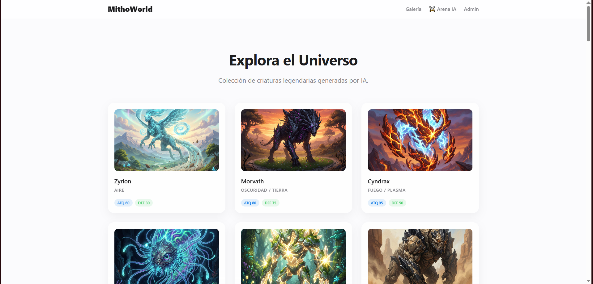
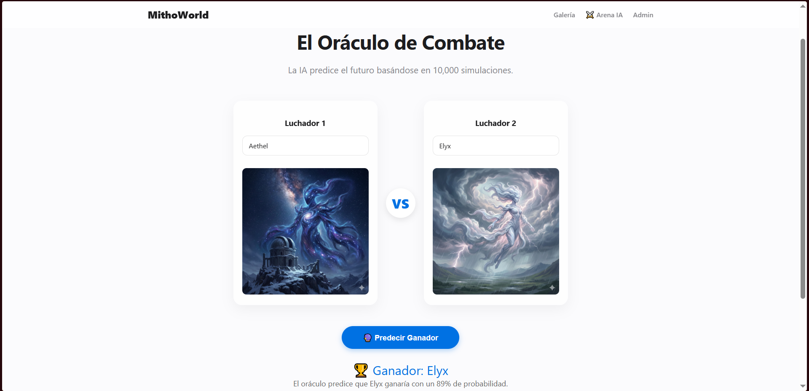
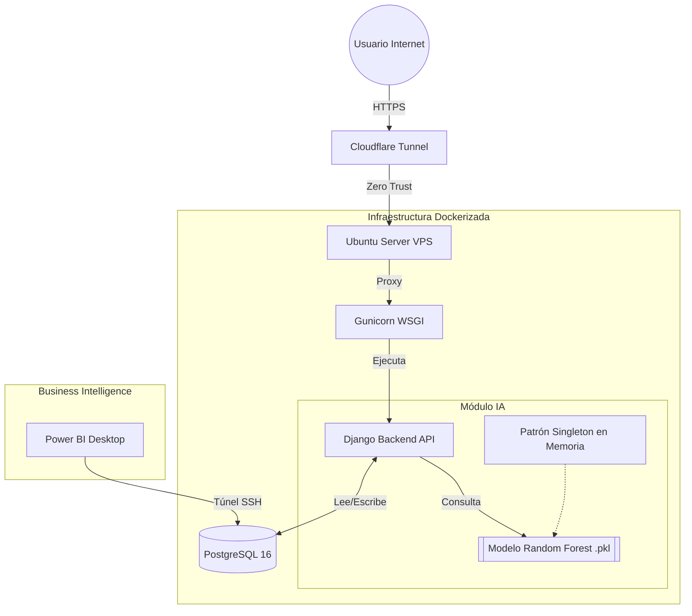

# 🐉 MithoWorld: Universo de Criaturas con IA


Una plataforma web Full Stack que combina gestión de datos, visualización y predicción de combates mediante Machine Learning. El proyecto simula un universo de criaturas mitológicas donde una IA predice ganadores de batallas basándose en estadísticas y reglas elementales.

🔗 **Demo en vivo:** [https://mithoworld.yurack.com](https://mithoworld.yurack.com)

## 📸 Capturas de Pantalla

|                    Página Principal                    |               Sistema de Batallas (Oráculo IA)               |
| :----------------------------------------------------: | :----------------------------------------------------------: |
|  |  |

---

## 🚀 Características Principales

### 1. Gestión de Datos y API

- **API RESTful:** Construida con Django Rest Framework (DRF) para servir datos a cualquier cliente.
- **Base de Datos:** PostgreSQL corriendo en contenedor Docker.
- **Automatización:** Script personalizado (`BaseCommand`) que puebla la BD desde un CSV e inyecta imágenes binarias automáticamente.

### 2. Inteligencia Artificial (El Oráculo)

- **Generación de Datos Sintéticos:** Script que simula 10,000 batallas aplicando lógica de negocio (ventajas de tipos, stats + factor aleatorio).
- **Modelo de ML:** Entrenamiento de un algoritmo **Random Forest** (Scikit-Learn) con un 93-98% de precisión.
- **Persistencia:** Carga de modelos `.pkl` en memoria (Singleton) para predicciones de alta velocidad en tiempo real.

### 3. Frontend & UI

- **Single Page Application (SPA) feel:** Renderizado dinámico con Vanilla JavaScript (sin recargas).
- **Diseño Glassmorphism:** CSS moderno, responsivo y minimalista.

### 4. Infraestructura & DevOps

- **Servidor:** Ubuntu Server.
- **Proxy & Seguridad:** Gunicorn + Cloudflare Tunnel (Zero Trust).
- **Almacenamiento:** WhiteNoise para estáticos y gestión de Media Files.

---



## 🛠️ Stack Tecnológico

| Área              | Tecnologías                               |
| ----------------- | ----------------------------------------- |
| **Backend**       | Python, Django 5, DRF                     |
| **Frontend**      | HTML5, CSS3, JavaScript (ES6+)            |
| **Base de Datos** | PostgreSQL 16                             |
| **DevOps**        | Docker, Docker Compose, Gunicorn, Systemd |
| **Data Science**  | Pandas, Scikit-Learn, Joblib              |
| **Cloud/Redes**   | Cloudflare Zero Trust, SSH Tunnels        |
| **BI**            | Power BI (Conectado vía túnel SSH)        |

---

## ⚡ Instalación y Despliegue Local

1. **Clonar el repositorio:**
   ```bash
   git clone git@github.com:Luis-e-rf/MithoWorld.git
   cd MithoWorld
   ```
2. **Configurar entorno virtual:**
   ```bash
   python -m venv venv
   source venv/bin/activate  # En Windows: venv\Scripts\activate
   pip install -r requirements.txt
   ```
3. **Levantar Base de Datos (Docker):**

   Asegúrate de tener Docker Desktop o Docker Engine corriendo.

   ```bash
   docker-compose up -d
   ```

4. **Variables de entorno:**

   Crea un archivo .env en la raíz del proyecto basándote en este ejemplo:

   ```bash
   SECRET_KEY=tu_clave_secreta_django
   DB_NAME=mithoworld_db
   DB_USER=mitho_user
   DB_PASSWORD=tu_password_segura
   DEBUG=True
   ```

5. **Inicializar datos (ETL y Migraciones):**

   Ejecuta estos comandos en orden para construir la DB y la IA:

   ```bash
   python manage.py migrate
   python manage.py poblar_criaturas  # Lee CSV y carga imágenes
   python manage.py simular_batallas  # Genera dataset histórico
   python manage.py entrenar_oraculo  # Entrena el modelo Random Forest
   ```

6. **Correr servidor de desarrollo:**
   ```bash
   python manage.py runserver
   ```

Accede a: http://localhost:8000

---

## 🏗️ Arquitectura de Despliegue (Producción)

El proyecto está diseñado para desplegarse en un VPS Ubuntu utilizando la siguiente pila:

- **Gunicorn:** Servidor de aplicaciones WSGI (gestionado por Systemd).
- **WhiteNoise:** Para servir archivos estáticos comprimidos eficientemente.
- **Cloudflare Tunnel:** Para exponer el servicio local (`localhost:8000`) a internet mediante HTTPS seguro sin abrir puertos en el firewall.

### Comandos de Mantenimiento en Producción

```bash
# Actualizar código
git pull origin main

# Aplicar cambios en estáticos (CSS/JS)
python manage.py collectstatic

# Reiniciar aplicación
sudo systemctl restart mithoworld
```

---

## 🧠 Bitácora de Aprendizaje (Challenges & Soluciones)

Este proyecto sirvió como laboratorio para resolver retos de ingeniería real:

- **Reto:** Conectar Power BI local a una base de datos remota protegida en Docker.

  - **Solución:** Implementación de un Túnel SSH (`ssh -L`) para exponer el puerto de la BD de forma segura a localhost sin abrir puertos externos.

- **Reto:** Latencia alta en predicciones de IA.

  - **Solución:** Optimización de carga de modelos usando patrón Singleton (cargar `.pkl` fuera de la clase de la vista) para evitar I/O de disco en cada petición HTTP.

- **Reto:** Persistencia de imágenes en despliegue automatizado.
  - **Solución:** Script personalizado que inyecta imágenes binarias a la base de datos PostgreSQL leyendo desde una carpeta temporal, permitiendo portabilidad total del proyecto.

---

## ✒️ Autor

**Luis Ernesto Rodriguez Felacio (Yurack)** - [LinkedIn](https://www.linkedin.com/in/luis-ernesto-rodriguez-felacio/)

_Ingeniero Informático & Especialista en IA_
